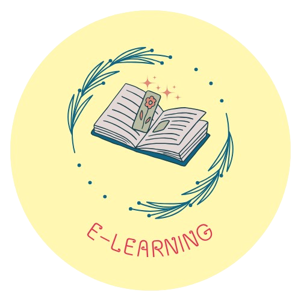
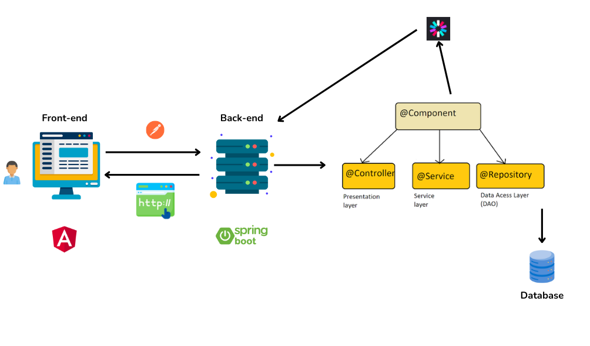
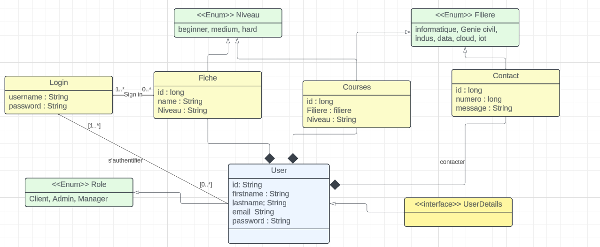

## Introduction
Bienvenue sur e-learning, votre destination éducative complète pour les études de niveau supérieur. Explorez une multitude de filières, plongez dans des contenus variés, interagissez de manière dynamique, et bénéficiez d'un suivi personnalisé. Avec flexibilité et accessibilité, préparez-vous à exceller dans votre domaine d'études spécifique sur la plateforme e-learning.
## Problem Statement
Comment optimiser l'engagement des étudiants de différentes filières sur la plateforme e-learning, en tenant compte des spécificités de chaque domaine d'études, pour garantir une expérience d'apprentissage enrichissante et motivante ?
## Proposed Solution

E-learning, 
notre plateforme dédiée à l'enseignement supérieur, se distingue par une architecture technologique pour répondre aux exigences évolutives de l'éducation en ligne.
Le frontend, développé avec Angular, offre une navigation intuitive, permettant aux étudiants d'accéder facilement aux cours et aux ressources éducatives. 
Côté backend, nous avons choisi Java en conjonction avec le framework Spring Boot pour sa fiabilité, sa sécurité et sa flexibilité. 
Cette combinaison puissante permet non seulement une gestion efficace des données, mais également une mise à l'échelle harmonieuse pour accompagner la croissance constante de notre communauté étudiante. 
Avec E-learning, nous nous engageons à fournir une plateforme technologiquement avancée, favorisant un apprentissage enrichissant et adapté aux défis complexes du niveau supérieur.

## Architecture & Road map
<h5>Architecture</h5>

## Conception

## Contributers
 [Othmane tozy](https://github.com/othmanetozy)
 
[Zidane Moulay](https://github.com/ZidaneMoulay)

[Jalal Himed](https://github.com/jalalhm)

[El Ouali Med](https://github.com/Medelouali)
